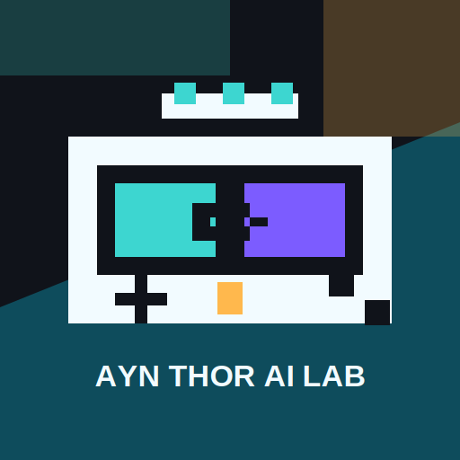

# GameThor



Personal vibecoded Android fork of [GameNative](https://github.com/utkarshdalal/GameNative) for the AYN Thor handheld. No promises. No support. Fork it and own the result.

GameThor keeps the upstream GameNative foundation for running legally owned PC games on Android, then bends the experiment toward one handheld target: AYN Thor. This is not upstream GameNative, not an official release channel, and not a general Android compatibility project.

> [!WARNING]
> This fork is vibecoded with AI assistance. That is intentional and disclosed. If AI-assisted code, docs, or generated assets bother you, use upstream GameNative or another fork.

> [!CAUTION]
> Personal-use experiment. No guarantee of stability, compatibility, correctness, performance, support, or future updates. No games, keys, DRM material, store credentials, BIOS, firmware, or commercial game files are included.

## What This Is

- Android-focused GameNative fork for AYN Thor testing.
- Branded as `GameNative AYN Thor AI Lab` in the app.
- Built around Thor-first compatibility experiments instead of broad device support.
- Tuned for legally owned PC games launched through GameNative-style containers.
- A place to collect Thor presets, controller bridge fixes, runtime patches, and proof logs.

## Target Hardware

Optimization work assumes the AYN Thor handheld family. Defaults and presets should be driven by real Thor testing, not random Android phones, tablets, emulators, or desktop assumptions.

If a change is only proven on one Thor unit, say that. If a setting is speculative, keep it behind a preset, build flag, runtime check, or clearly named experimental path.

## What This Is Not

- Not upstream GameNative.
- Not an official GameNative release.
- Not a supported Android PC gaming distribution.
- Not a compatibility reporting project for every device.
- Not a place to request games, cracks, bypasses, keys, accounts, or commercial files.
- Not an online-cheat, anti-cheat-bypass, multiplayer-cheat, or DRM-bypass project.

## Support And Issues

Do not open issues expecting support for this experiment. Fork it, patch it, and own it.

Do not send GameThor-specific breakage to upstream GameNative. Upstream GameNative has its own goals, maintainers, rules, and support expectations.

## Where This Fork Diverges

GameThor has moved away from stock GameNative in visible and practical ways:

- App-facing branding identifies the lab build as `GameNative AYN Thor AI Lab`.
- The writable fork remote is `git@github.com:noeldvictor/GameThor.git`; pushes should use SSH.
- HGO lab presets collect tested Wine, DXVK, graphics, controller, and env recipes.
- Launch presets can be supplied through JSON or Android intent extras such as `hgoLabPreset` / `hgo_lab_preset`.
- Thor controller work includes raw input passthrough, private EVSHIM shared-memory paths, and Android-to-Wine bridge debugging.
- Helper overlays are expected to work by controller, show clear toggle state, and stay scoped to legally owned offline single-player use.
- Runtime experiments include optional imagefs patches for GStreamer and HGO MediaCodec paths.
- The HGO MediaCodec H.264 path is used to test hardware video decode on Thor.
- DXVK canaries track Thor-specific Vulkan, DRI3, wrapper, and presentation behavior.
- The fork favors log-backed proof over guessing: exact env vars, loaded plugins, screenshots, and `logcat` evidence matter.

For the working notes behind these differences, see [agent.md](agent.md) and [AGENTS.md](AGENTS.md).

## Build Locally

This is an Android project. Configure Android Studio or create a repo-local `local.properties` with your Android SDK and NDK paths, then build with Gradle:

```powershell
.\gradlew.bat :app:assembleDebug
```

For local command-line Java builds on the maintainer workstation, the agent notes document the expected JDK/SDK paths and compile check.

Generated APKs, Gradle caches, runtime imagefs archives, extracted runtimes, Android SDKs, and game files should not be committed.

## Runtime Experiments

GameThor experiments may involve optional runtime archives such as GStreamer or HGO MediaCodec patches. These are treated as local build/test artifacts unless deliberately added through normal source paths.

Do not assume an env var enabled a runtime feature. Prove the plugin exists in the imagefs, prove it loaded, and prove the game path used it.

## Legal Scope

Use this only with games you legally own. This repository does not include commercial game data and should not be used to redistribute modified commercial game files.

Offline helper and cheat-overlay work is limited to personal, legally owned, offline single-player use. Do not use this project for online cheating, multiplayer cheating, anti-cheat bypasses, DRM bypasses, account abuse, or piracy.

## Privacy

GameThor removes the upstream analytics hooks, ad/support prompts, affiliate-style recommendation data, and the built-in recommendation feed. There is no PostHog dependency, no in-app ad surface, and no opt-in usage analytics setting in this fork.

Review the [Privacy Policy](PrivacyPolicy/README.md) before sharing builds.

## Upstream Credit

GameThor exists because [GameNative](https://github.com/utkarshdalal/GameNative), Winlator, Wine, Box64, FEX, DXVK, VKD3D, Mesa, GStreamer, Android, and many other open-source projects did the foundational work.

This repository remains under the upstream license terms. See [LICENSE](LICENSE) and [THIRD_PARTY_NOTICES](THIRD_PARTY_NOTICES).
